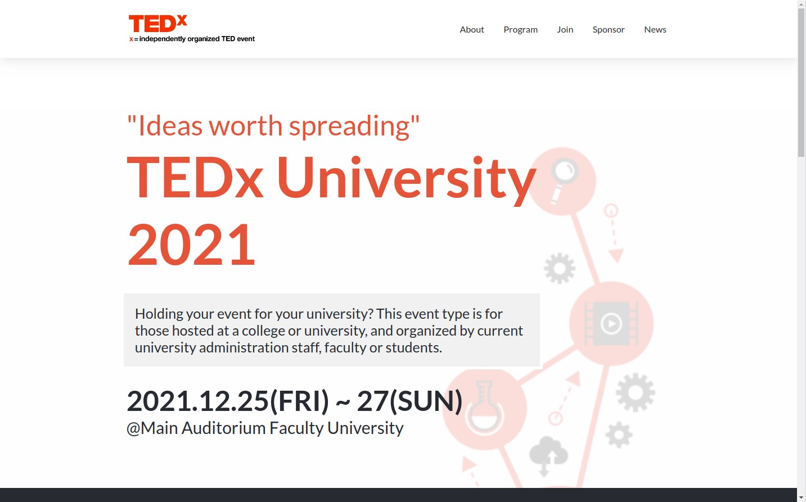

# TEDx University

> As you may have seen or heard about TED. In this project I wanted to create a template for TEDx University. It can be used for other purposes like: Courses, events, organization and etc.

## This is how it looks on desktop.

## This is how it looks on mobile.

As you can see It's adaptive to screen size both for pc and mobile users.

## Built With

- HTML
- CSS
- Javascript DOM

## Live Demo

[Live Demo Link](https://shadabwahidullah.github.io/TedxUniversity/)

## Getting Started

To use this project you need to first clone this project to your computer using git clone url command or by downloading the zip file. Once the download completed, run index.html file

To get a local copy up and running follow these simple example steps.

## Authors

👤 **Wahidullah Shadab**

- GitHub: [@githubhandle](https://github.com/shadabwahidullah)
- LinkedIn: [LinkedIn](https://www.linkedin.com/in/wahidullah-shadab-2712031a3)

## 🤝 Contributing

Contributions, issues, and feature requests are welcome!

Feel free to check the [issues page](../../issues/).

## Show your support

Give a ⭐️ if you like this project!

## Acknowledgments

I want to thank Cindy Shin for providing the design. You can have more information about him [here](https://www.behance.net/adagio07).

## 📝 License

This project is [MIT](./MIT.md) licensed.
